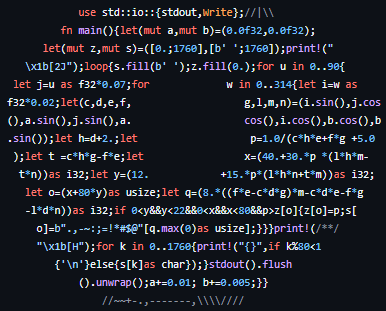

# My Projects

## 1. Weather App

A simple weather app that shows real-time weather data and supports location tracking.
Weather data is fetched from the [OpenWeatherMap API](https://openweathermap.org/api).
Based on this tutorial:
[Build a Simple Weather App with Vanilla JavaScript](https://webdesign.tutsplus.com/build-a-simple-weather-app-with-vanilla-javascript--cms-33893t)

### Run locally

```bash
python3 -m http.server 8000
# Then open: http://localhost:8000
```


## 2. Rust Donut
A rewrite of the famous [donut.c](https://www.a1k0n.net/2011/07/20/donut-math.html) project in rust.





---

## Future Project Ideas

YouTube: ["One project EVERY WEEK"](https://www.youtube.com/watch?v=nr8biZfSZ3Y)
Repo: ["Project based learning"](https://github.com/axelbdt/project-based-learning)


